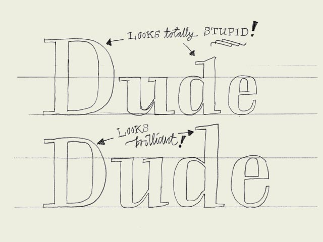

**Proportions.** Which x-height to define? Which descender depth? Defining these proportions are essential, and very strongly connected to the purpose of the type. The proportions within a certain typeface are influencing the way your type will work & look. For example, it's impossible to create a space saving newspaper typeface with an extremely wide body width.

Extremely short descenders will give a strange look to a text typeface. Even worse, they might not be visible at all anymore. But extremely short descenders can also be a smart decision, while creating a display or headline type. For a text typeface the ascender height should be as big or, even better, bigger than then cap height to give a optical pleasurable result (see drawing).