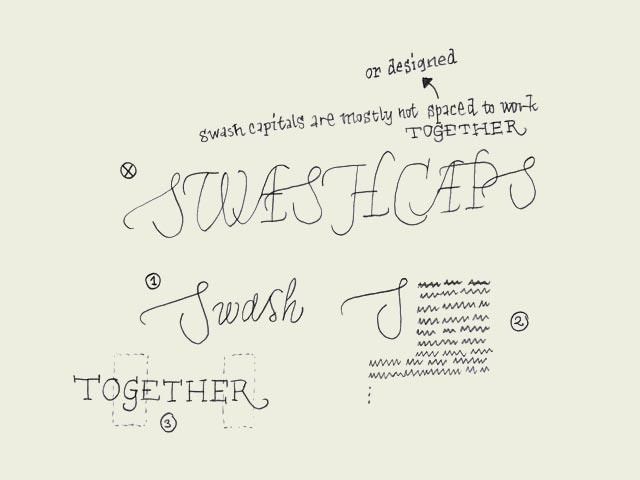

**Swash caps?** Admitting that it's not the most urgent issue to learn in typography, it's interesting to quickly pay attention to this topic. Not every font family has a Swash variant. Most common are swash capitals, but also swash lowercase characters and swash-beginnings and -endings exist.

Sometimes you want to set a whole line in capitals. It's possible to do this with roman capitals, although sometimes it's better to choose small capitals which are designed for this purpose. Roman capitals are not, but mostly they don't cause problems. Swash capitals however do. Swash capitals are mostly designed to give some extra visual pleasure to your designs. The caps are meant to be followed by lowercase characters (number 1), or used as an initial (number 2), but not to be combined with eachother. Only with some fonts it's possible to combine swash capitals with normal roman caps (number 3).