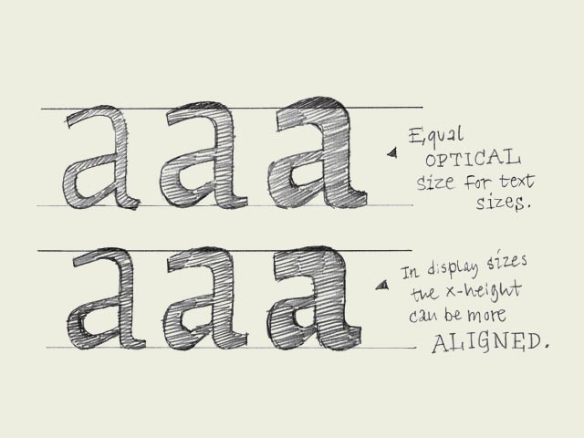

**x-heights.** If you make a light weight and the black weight of one typeface, you'll have to make sure that the black weight has a bigger x-height than the light weight (top line drawing). If this is not the case, the black weight will look optically too small when it's combined with the light weight in a line of text.

In display sizes this is not exactly the same. If the type is printed in big sizes there can be a much smaller difference between the x-height of the light and the black weight (bottom line drawing).