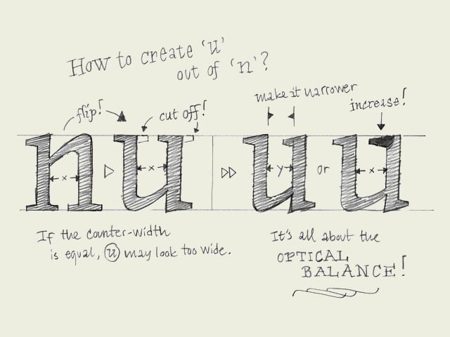

**Copy-paste?** When you have created a few basic characters, you also want to create the rest of the alphabet. But how? Copy and paste? Euhm, not really. Although, this can help you on the way.

There are some things which you can do, and some which you cannot do while copy-pasting. Some forms can be just the same. The ascender of the 'l' and 'h' for example. But maybe the bowl of the 'd' and 'q' as well. Once you created a 'd', this could work fine as a starting point for a 'b' and a 'p', by rotating the 'd' 180 degrees.

Copy-paste should not change the contrast in your typeface. When you make a typeface based on the broad nip, horizontal and vertical flipping will disturb the angle of your contrast, and will destroy your shape. However, by rotating a (part of a) character 180 degrees, the contrast remains perfect and untouched.

But copy-paste doesn't bring you all the way there. It can work as a starting point, but manual adjustments will be mostly necessary. For example, if you have a 'n', you can quite quickly make a 'm' and a 'h', but also a 'u' (see drawing). Copy, paste and rotate the 'n'. Then cut some serifs, and... not ready yet! If you cut away the serifs, also on the inner side of the 'u', the white space inside the 'u' will get bigger then the white space inside the 'n'. This has to be optically corrected.

One solution for this could be to make the 'u' a bit more narrow, or maybe another solution could be to make the serif on the top a bit longer (which also makes the innerform smaller of course). Whatever way you do it, make sure the inner forms have (optically) the same amount of white space. Only in that way you'll get a harmonious rhythm in your type.