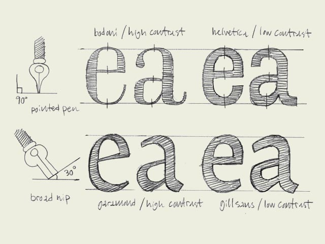

**Calligraphic origin.** The characters on the top line have a different construction than the characters on the bottom line. They have a different calligraphic origin. It doesn't matter if a typeface has serifs (like Times New Roman) or not (like Arial). It's about the original way they where constructed.

The characters in the top line are constructed with a pointed pen (calligraphic tool). The contrast is caused by changing the pressure on the pen, not because of the form of the pen. Bodoni is one example of this, but also sans serif faces like Helvetica have this origin. The thickest part will be (mostly) totally vertical. From this perspective there is no difference between Bodoni and Helvetica. They both have the same construction. Only the contrast varies.

The characters in the bottom line have a origin which is derived from the broad nib. The calligraphic pen itself has a thick and a thin part. The contrast in the type is made because of the form of the pen, not because of the pressure. You slant the pen with an angle of 30 degrees on the paper. In that way your thickest part of a character will not be on a vertical direction, but will be on an angle. Also the thinnest part will not be on the most horizontal parts. Typefaces like Garamond and Minion have this kind of construction. But also sans serif faces like Gill Sans have a construction which is originally derived from the broad nib.

If you want to know more about these different origins, read the books of [Gerrit Noordzij](http://www.letterror.com/noordzij/index.html). His expansion and translation theories are explained in many of his writings. 'The stroke of the pen' is a good starting point. You can also read a small part of Noordzij's theories [on-line](http://www.letterror.com/noordzij/streek/chapter2/index.html).