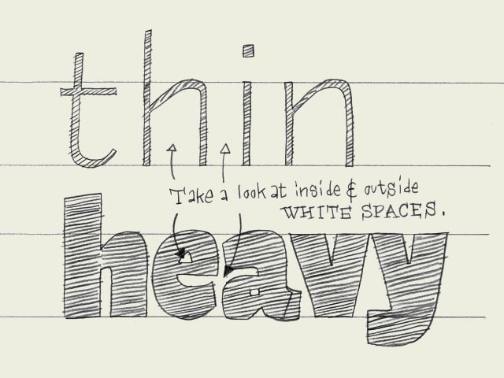

**Black vs. white.** Designing type is nothing more and nothing less than harmonizing black and white shapes. Black can't exist without white, and white can't exist without black. Black, the shape of a letter. White, the space in or in between letters. The amount of white inside a character defines the amount of white in between two characters.

As it is impossible to create a very black character with a big (white) counter form, a black typeface will always have smaller counters than a light typeface. Hence it follows that there is less space in between the characters (see drawing). A light typeface has much bigger counters. The space in between two letters has to be in proportion. As a consequence there is more white space in between light letters than in between black letters.