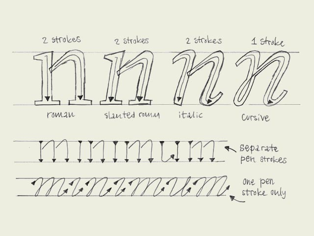

Italic vs. cursive.** A roman font can be slanted (having an angle) and a cursive font can be upright (totally vertical like a roman). Urgh!

The angle doesn't decide if a character is a 'roman' character or an 'cursive' character. This depends on the construction. To make it a bit more clear, take a look at the four big n's. As you would expect, the first letter is a roman character. But the second one as well. Although it's not totally vertical, it still has the same construction as the first 'n'. This is called a slanted roman. The third 'n' looks like an cursive, but also this one is not a real cursive. Basicly there is no difference between the second and third 'n', only some parts of the serifs have been cut off.

Compare the first three letters with the last 'n'. That's a real cursive. The big difference with the previous three is the construction. The first three are constructed from separate pen strokes. The last 'n' is constructed out of one pen stroke. This is the basic difference between roman and cursive fonts. Not the angle, but the construction.

Many different explanations can be given for the difference between a 'cursive' and 'italic' from a historical point of view. However we consider this as the big difference: 'italic' is concerning the function, 'cursive' is concerning the construction. Almost anything can work as an 'italic', it doesn't even necessarily needs an angle. When making a font family with a roman and an italic font, the italic font can be constructed in many different ways. The third 'n' in the example could probably function perfectly as an italic inside your family. But don't forget, it's not always a real cursive when it's called 'italic'.