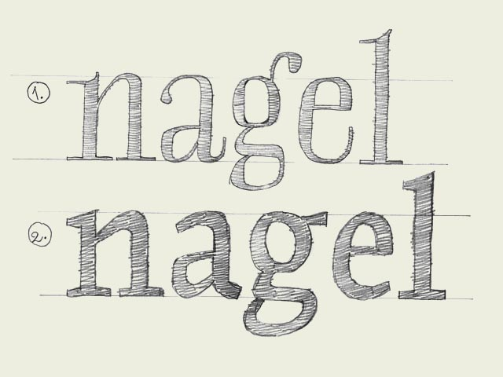

**Readability.** The only important aspect of a text typeface is the readability. Many decisions can influence the readability. Which contrast you create, the length of the ascenders and descenders, the rhythm, the blackness of a type, the strength of the curves and the bowls, etc.

Most of those decision apply to all the characters inside a font. These have to be defined first. For example the contrast. The characters on the top line (see drawing) have a much bigger contrast than the characters on the bottom line. The type on the top line will be more suitable for display use, the type the bottom the bottom line more for text use. Not only because of the difference in contrast, but also because the characters on the top line are much more condensed. This makes them less legible in small sizes, but more eye-catching and flexible for headlines. Defining the contrast and the width are decisions which count for every single character in a font.

But also while designing every single glyph, you can create details which improve the readability of a font. For example, the ear of a 'g' can make sure the reader's eye will follow the horizontal reading direction more fluently. The 'g' on the bottom line will work much better in a text typeface for small sizes (see drawing).