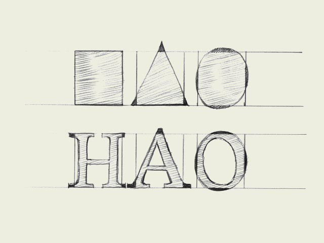

**字体设计基础**

【字体设计基础】系列翻译自 [typeworkshop.com](http://www.typeworkshop.com/index.php?id1=type-basics&id2=&id3=&id4=&id5=&idpic=01#pictloader)，每篇文章都配有精美的插图，用于解释设计字体时会遇到的一些基础的问题。这些内容只解释了一些基础概念，不会深入讨论复杂的内容。

**Same size for all!** To optically align all characters on a line, they cannot not have exactly the same mathematical height. For example the triangle on this drawing has to be higher than the rectangle. If this is not the case, the triangle will for sure look smaller than the rectangle. While creating a typeface, you want all the letters to have the same height.

> 一视同仁！！为了让所有字体在视觉上对齐，它们就不能采用恰恰相同的尺寸。比如说，上图中的三角形必须的高度必须大于矩形。否则，三角形就会看起来比矩形小。在设计字体的时候，我们往往想要所有的字母定义同样的高度。

Also round forms have to exceed the baseline to be optically the same. If the circle would have exactly the same mathematical height as the rectangle, it would look smaller than the square. This doesn't only count for basic forms like triangles, circles and squares. It's essential in type design, because they apply to every single character in a typeface. Then it even doesn't matter if you're designing a latin, cyrillic or greek font. It's a basic principle for any kind of shape.

> 同样的，为了使圆形看起来和矩形相同大小，就必须得让圆形超出基线。如果圆形的高度和矩形完全相同，就会看起来比方形更小。这种情况不仅适用于像三角形，圆形和方块这样的基本形状。这是字体设计的基本原则，整个字体中的所有字符都适用这套原则。甚至不论你正在设计拉丁，斯拉夫还是希腊字体，这种效果都同样适用。这是所有形体都必须遵循的基本原则。