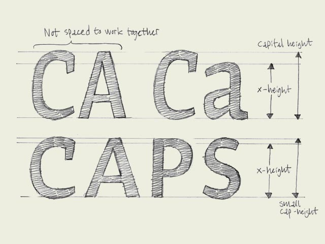

**Small caps.** You could guess it already from the name, small caps are small capitals. Capitals which have the same height as lowercase characters.

Why are small caps needed? Because of several typographical reasons. First of all a whole word set in caps will look awful, it will drown out the rest of the text. Second, in lots of typefaces the capitals are not designed and spaced to work together, but to be followed by a lowercase character. Small caps however are designed to purely work together. They will give a more pleasurable, harmonized result.

Having said that small capitals are capitals on x-height, it's mostly not 100% true. To optically give them the same height, the small caps will have to be slightly bigger than lowercase characters of the same font (see drawing).