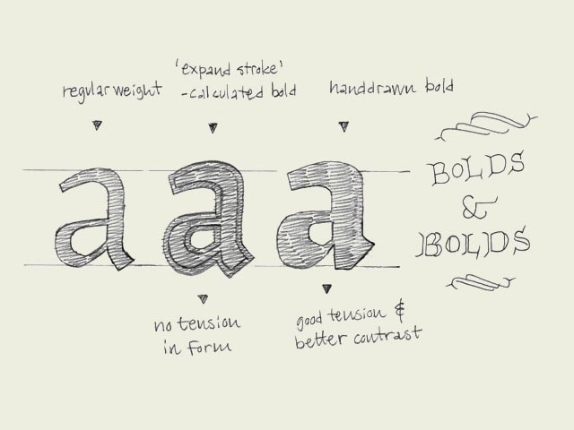

**Bold-faced.** Since the introduction of the computer, type design has become available to a wide audience like never shown before in history. Of course the digitalization makes many acts easier and particularly faster. This doesn't mean it automatically gets better, but that's another story. For example, many font software programs have included an option to 'bolden up' your regular weight. The outlines of the perfectly designed font get expanded, but the program is trying to fool you. That's not a bold. It's a limousine which got quickly extended by a local blacksmith. The contrast will probably be destroyed (see the second 'a' in the drawing). Doing this by hand will give a much more pleasurable result. No matter how well font software programs will improve in the future, there is only one thing that really counts in the end: your critical eye.