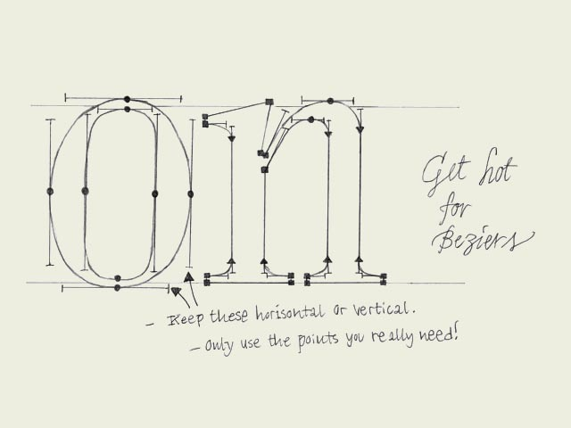

**Digitizing sketches.** When the handmade sketches on paper are ready to be scanned, take care of digitizing them in a proper way. More specifically, take care while converting your scanned image manually with a Bezier based pen tool. Too many points on a character, or points at the wrong position can have a negative influence at your font.

Too many points (=nodes) can not only cause technical problems -e.g. the printer can't print the font anymore- but it is also much harder to control the shapes of a character. Controlling a curve between two nodes is much easier than changing a curve with twelve nodes. Of course it's possible, but it will not end up in a fluent form.

Having the nodes at the wrong position can cause technical problems -e.g. it's impossible to hint the font perfectly- but also practically it is recommendable to put nodes at extreme positions at your glyph. For example, digitizing an 'o' would only need 8 nodes. Four at the outer form, four at the counter form. Putting nodes at extreme positions (most top & down, most left & right) means the BCP (Bezier Control Point) will always be totally horizontal or vertical. In that case they are much easier to control. In most software programs you can use shift key to keep the BCP totally horizontal or vertical.