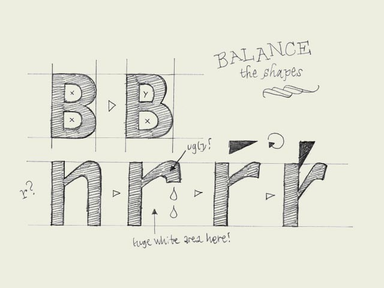

**Balance shapes.** If you make both of the inner forms (counters) of the 'B' exactly the same, the top counter will optically look bigger. Your character will look plumby, like it's falling down. If you make the top counter smaller than the bottom one, your character looks much more balanced.

The counter of the 'B' doesn't have to be exactly the same as the counter of the 'P' for example. If you would make them exactly the same, the right sidebearing of the P would be much too big. So you have to balance the black and white spaces in every character separately. However, there must be a relationship between the amount of white space inside a 'B' and inside a 'P'.

About making a lowercase 'r': it's not an 'n' with an amputated leg. Your 'r' can get very weak and soft in that way. You can make it much stronger if you let the ending of the 'r' follow the horizontal reading direction. In that way, the space on the right side of the 'r' will be more open, and more balanced. It will not disturb the rhythm of your type because the right sidebearing can be much smaller. The whole letter can be made more narrow as well. As a consequence the white space in the top of the 'r' could be has to be changed. In case you change that form, optically you'll not confuse the 'r' so quickly with the 'n' as well.