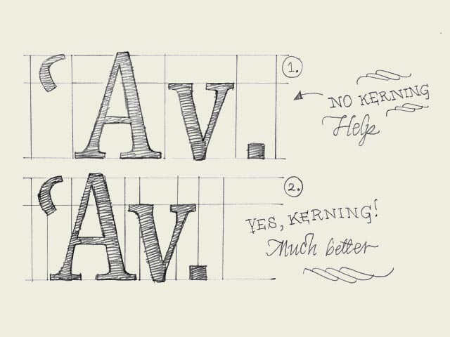

**Kerning.** Knowledge about kerning will give a deeper understanding of type. However, forget about kerning for now, spend your time on other things. It's much more important to properly space your characters.

A kerning pair is a technical issue for optical reasons. Simply said: when one certain character is followed by another character you can define a different space in between these two characters. This space can vary from the the normal spacing (right sidebearing of the first character + left sidebearing of the second character). The difference can be positive or negative; you can add more space for a certain combination or you can reduce the space. A kerning pair can technically be implemented in a digital font file.

In some cases kerning is inevitable and necessary. When a capital 'A' is followed by a lowercase 'v', a big white space will appear which cannot be solved by adapting the spacing of the characters. Changing the spacing would mess it up when they would be combined with other characters again. For this occasion a kerning pair is needed (see drawing). In the sketch you only see some examples where the kerning pair is negative; reducing space. But you can also imagine a positive kerning pair when a 'f' is followed by a bracket for example; "f)". More space has to be added to avoid those characters overlapping eachother.