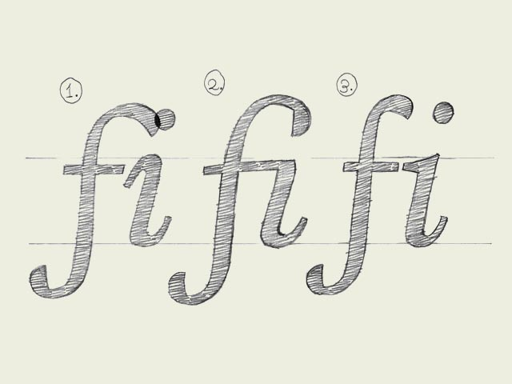

**Ligatures.** In a very few cases they are essential. Some well known ligatures are 'fi' and 'fl'. The inevitable need for a ligature is depending on the design of a font. Not every typeface will need a ligature for a 'fi' combination. But in some cases the dot of the 'i' is interfering with the 'f'. Get rid of all that annoying row but making a ligature, one glyph which represents two (or more) characters. Next to a functional aspect, there is an aesthetic aspect of ligatures. You could create a ligature for a 'st' combination, or maybe for 'nky' or 'ism'. Anything is possible. Admitting that also this is not the most urgent issue in type design, it's another obstacle on the road to perfection!