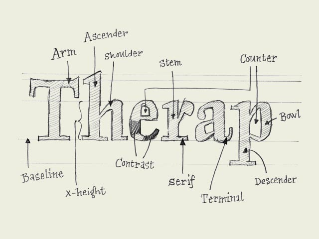

**type basics**

**100% practical.** Sketches have been made to explain some basic issues in type design during the workshops. They get used to point out some problems which raise while creating a new typeface. Only some foundations are shown, no deep sophisticated details.
Any suggestions? [Let us know](mailto:info@underware.nl).
[[Type-basics in hungarian](http://www.sese.hu/typeworkshop/typeworkshop.html)] : [[Type-basics in spanish](http://www.unostiposduros.com/?p=2236)] : [[Type-basics in german](http://www.manuel-bieh.de/publikationen/typografie/typeworkshopcom.html)]

**Type terminology.** Communication during the design process is much easier when using basic terminology of type. Here are a couple important ones, which will help to bring the conversation a bit further than 'yeah, that there, that little black thing.' The counter of the 'e' can also be called an 'eye', but there are many more terms. If you want to know them all, go to the library or [browse](http://www.adobe.com/support/techguides/printpublishing/typography_basics/letterform_anatomy/main.html)-[the](http://gmunch.home.pipeline.com/typo-L/faq/anat.htm)-[web](http://www.planet-typography.com/manual/anatomy.html).