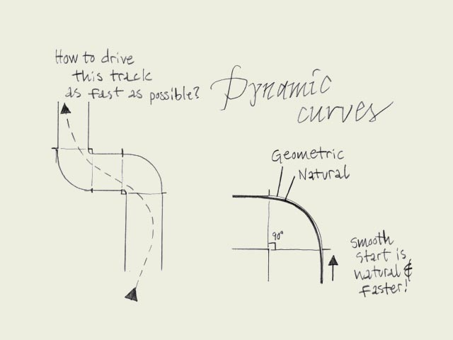

**type basics**

**100% practical.** Sketches have been made to explain some basic issues in type design during the workshops. They get used to point out some problems which raise while creating a new typeface. Only some foundations are shown, no deep sophisticated details.
Any suggestions? [Let us know](mailto:info@underware.nl).
[[Type-basics in hungarian](http://www.sese.hu/typeworkshop/typeworkshop.html)] : [[Type-basics in spanish](http://www.unostiposduros.com/?p=2236)] : [[Type-basics in german](http://www.manuel-bieh.de/publikationen/typografie/typeworkshopcom.html)]

**Fluent shapes.** Designing type is like driving a car. If you drive a car, you always take the curve in a natural way. If you draw a curve (of a character) on paper, this is exactly the same. The curve starts smoothly, never out of a sudden. While driving a car, you don't start turning the wheel when you are already in the beginning of the curve. A while before you arrive in the curve you anticipate by leading your car gently in the right direction. Think about driving a car when you are sketching type on a paper.