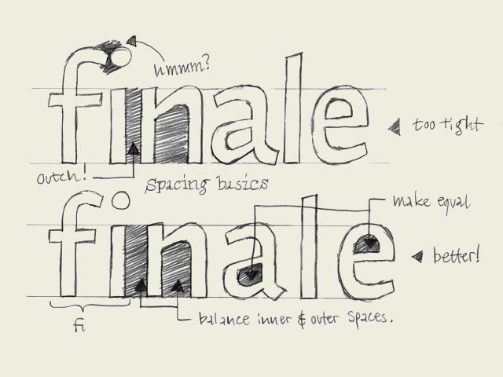

**Spacing.** Some words about spacing type. Much more important than the shapes of the characters, is the rhythm of the type. A typeface with beautiful characters which are badly spaced is extremely hard to read. However, if the shapes of the letters are not that good, but when they are all perfectly spaced, the type will be fairly easy to read. Defining the rhythm is more important than defining the shapes.

The white spaces inside and in between letters are defining the rhythm, much more than the black shapes of the letters. When you manage to create a good rhythm in your line of text, your type gets more readable and gives a balanced end result. While creating the black shapes, you have to take the white spaces into consideration. Because the white spaces are more important than the black shapes. However, white cannot exist without black. Changing a white shape, inevitable will have an influence on the black shape. From that perspective, one colour cannot be more important than the other. 

For example, there has to be a relation between the space inside an 'n' and the space between the 'i' and the 'n' (see drawing). In the top row you can see the space inside the 'n' is much much bigger than the space in between the 'n' and the 'i'. In the bottom row they are much more equal, and in this way you'll get a much better rhythm and more harmony in your line of text.

The same goes for the inner form of the 'a' and the 'e' for example. There is a big relation between these two forms. If they have (optically) the same amount of white inside the character (=counter), your type will have a better rhythm as well.