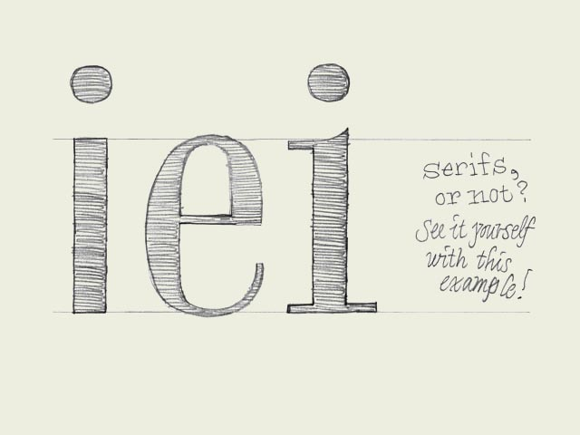

One for all** What defines if one character can fit to another character? Once you made a decision, how to apply this to all the other characters in a font?

Starting point: 'e' (in the center of the drawing). Imagine you sketched this 'e', you like it a lot, and now you want to design more characters fitting to this 'e'. Where to start? Should it be a serif or a sans serif for example?

First try: 'i' on the left. Sans serif. The black part is as thick as the black parts of the 'e'. Same x-height. So this should work you think.

Second try: 'i' on the right. Same thickness, the character has the same x-height, but now it has serifs.

The bowl of the 'e' is not only having a certain thickness, but the 'e' also has contrast. The 'i' on the left has no contrast at all. Therefore these two characters don't belong to each other. The 'i' on the right however has the same kind of contrast as the 'e', just because it has serifs. Just those tiny serifs make sure there are thick and thin parts, like the 'e' has. This means that the starting point, the 'e', already defined that the rest of the font cannot be a sans serif typeface.

Of course, every so called rule is there to be broken. Mentioning this, doesn't mean you can't make a font which has an 'e' combined with an 'i' like the one on the left. Everything is possible of course. But now you realize better what you are doing, also when you don't do it. Still get it?